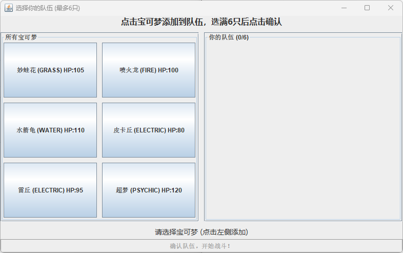
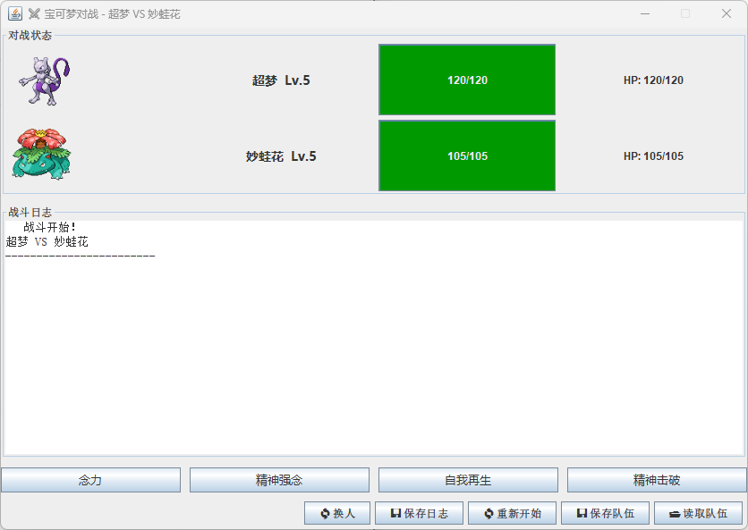
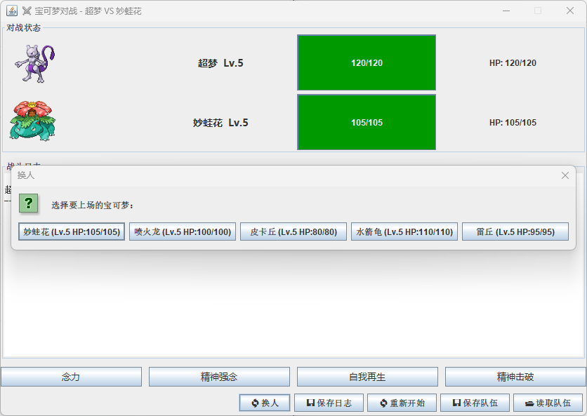
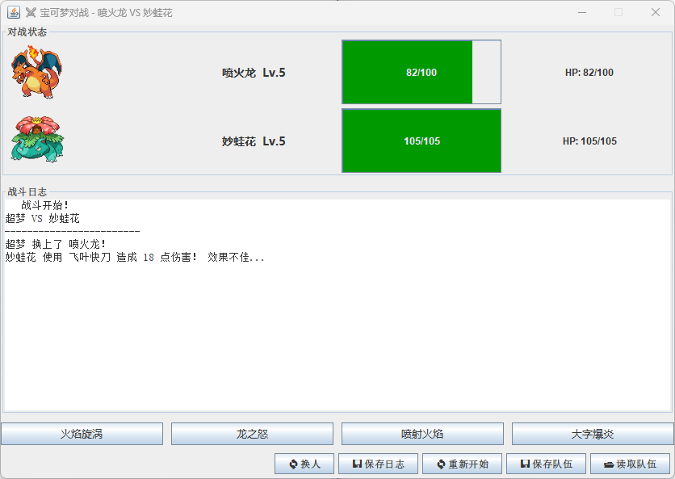
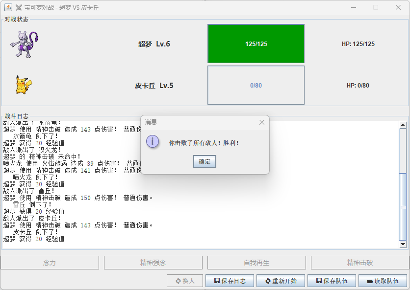
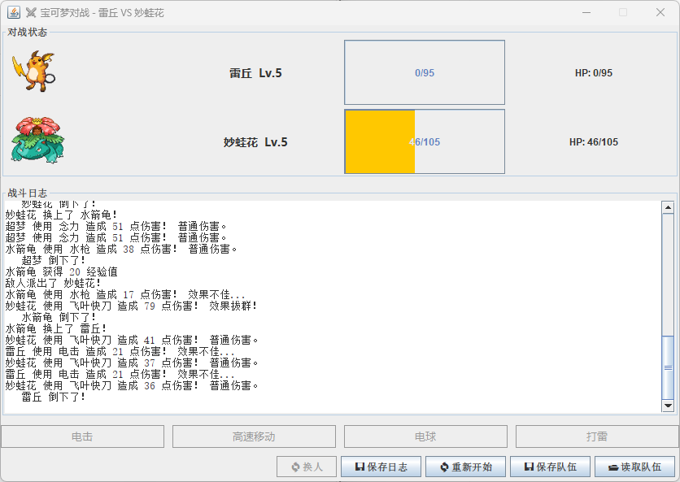

# 宝可梦对战模拟器 - 项目报告

## 一、项目设计

### 1.1 项目背景

本项目是一款基于 Java Swing 开发的桌面回合制对战游戏，灵感来源于Pokemon Showdown的对战系统。项目目标是通过综合运用 Java 面向对象编程、GUI 开发、数据库操作、IO 流、异常处理等核心知识，实现一个功能完整、交互流畅、具有一定策略深度的宝可梦对战模拟器。

### 1.2 核心功能

| 功能模块 | 具体功能 | 设计说明 |
|----------|----------|----------|
| 队伍系统 | 精灵选择、首发选择、手动换人 | 从6只精灵中选择6只组成队伍，战斗前选择首发，战斗中可随时自选换人 |
| 战斗系统 | 回合制对战、速度判定、属性克制、技能命中率、特殊技能效果 | 速度决定出手顺序；火→草→水→火循环克制；大威力技能有命中率；日光束蓄力、自我再生回血、寄生种子持续吸血、催眠粉使目标睡眠 |
| AI系统 | 主动换人、自动换人、最优属性选择 | 被克制时主动换人，死亡后自动选择最优属性精灵上场 |
| 数据持久化 | SQLite存储、Gson存档 | 精灵数据存储在本地SQLite数据库；战斗状态可保存为JSON文件 |
| UI系统 | 图片显示、血条变色、实时日志 | 每只精灵显示独立头像；血条根据血量百分比变色；战斗日志实时记录每回合操作 |

### 1.3 技术架构

本项目采用**分层架构**设计，共分为四层：

```
┌─────────────────────────────────────────────┐
│               表示层（GUI）                   │
│    TeamSelectionFrame  |  BattleFrame        │
│    （队伍选择界面）   │   （战斗主界面）       │
└─────────────────────┬───────────────────────┘
                      │
┌─────────────────────▼───────────────────────┐
│              业务逻辑层（Service）            │
│    BattleService（战斗核心逻辑）              │
│    速度判定、伤害计算、技能效果、AI换人      │
└─────────────────────┬───────────────────────┘
                      │
┌─────────────────────▼───────────────────────┐
│             数据访问层（DAO）                 │
│    DatabaseConnection | PokemonBaseDAO       │
│    （数据库连接）    │  （数据访问对象）       │
└─────────────────────┬───────────────────────┘
                      │
┌─────────────────────▼───────────────────────┐
│               数据存储层                      │
│    SQLite数据库（pokemon.db）                │
│    精灵表：id, name, type, hp, attack, speed │
│    skill1-4, image_path                      │
└─────────────────────────────────────────────┘
```

### 1.4 包结构

| 包名 | 功能 | 主要类 |
|------|------|--------|
| `model` | 实体类/数据模型 | Pokemon（抽象类）、FirePokemon、WaterPokemon、GrassPokemon、ElectricPokemon、PsychicPokemon、PokemonType |
| `dao` | 数据库访问对象 | DatabaseConnection、PokemonBaseDAO |
| `service` | 业务逻辑 | BattleService |
| `gui` | 图形界面 | TeamSelectionFrame、BattleFrame |
| `util` | 工具类 | TypeEffectiveness、FileUtil、GameSaveUtil |
| `exception` | 自定义异常 | PokemonFaintedException |

### 1.5 数据库设计

数据库表 `pokemon_base` 结构：

| 字段名 | 类型 | 说明 |
|--------|------|------|
| id | INTEGER | 主键，精灵编号 |
| name | TEXT | 精灵名称 |
| type | TEXT | 属性 |
| base_hp | INTEGER | 基础HP |
| base_attack | INTEGER | 基础攻击力 |
| speed | INTEGER | 速度值 |
| skill1 | TEXT | 技能1 |
| skill2 | TEXT | 技能2 |
| skill3 | TEXT | 技能3 |
| skill4 | TEXT | 技能4 |
| image_path | TEXT | 图片路径 |

初始6只精灵数据：

| ID | 名称 | 属性 | HP | 攻击 | 速度 | 技能 |
|----|------|------|-----|------|------|------|
| 1 | 妙蛙花 | Grass | 105 | 70 | 60 | 飞叶快刀、寄生种子、催眠粉、日光束 |
| 2 | 喷火龙 | Fire | 100 | 75 | 85 | 火焰旋涡、龙之怒、喷射火焰、大字爆炎 |
| 3 | 水箭龟 | Water | 110 | 70 | 65 | 水枪、咬住、水流尾、水炮 |
| 4 | 皮卡丘 | Electric | 80 | 55 | 90 | 电击、电磁波、电球、十万伏特 |
| 5 | 雷丘 | Electric | 95 | 80 | 100 | 电击、高速移动、电球、打雷 |
| 6 | 超梦 | Psychic | 120 | 90 | 130 | 念力、精神强念、自我再生、精神击破 |

### 1.6 核心类设计

#### Pokemon 抽象类

```java
public abstract class Pokemon {
    private int id;
    private String name;
    private int hp;
    private int maxHp;
    private int attack;
    private int speed;
    private PokemonType type;
    private String[] skills = new String[4];
    private int level = 5;
    private int exp = 0;
    private String imagePath;

    // 状态字段
    private boolean leechSeeded;    // 被寄生种子附身
    private boolean chargingSolar;  // 蓄力日光束
    private boolean sleeping;       // 睡眠状态
    private int leechSeedTurns;     // 寄生种子剩余回合
    private int sleepTurns;         // 睡眠剩余回合

    public int calculateDamage(Pokemon opponent, int skillIndex) {
        int power = skillPowers[skillIndex];
        double base = (double) this.attack * power / 50.0;
        double multiplier = TypeEffectiveness.getMultiplier(this.type, opponent.getType());
        double random = 0.85 + Math.random() * 0.15;
        return (int) (base * multiplier * random);
    }
}
```

#### 子类设计（继承与多态）

| 子类 | 属性类型 |
|------|----------|
| FirePokemon | FIRE |
| WaterPokemon | WATER |
| GrassPokemon | GRASS |
| ElectricPokemon | ELECTRIC |
| PsychicPokemon | PSYCHIC |

每个子类只包含构造方法，调用父类构造并传入对应的 `PokemonType` 枚举值：

```java
public class FirePokemon extends Pokemon {
    public FirePokemon(int id, String name, int hp, int attack, int speed,
                       String[] skills, String imagePath) {
        super(id, name, hp, attack, speed, PokemonType.FIRE, skills, imagePath);
    }
}
```

#### BattleService 战斗核心

| 方法 | 功能 |
|------|------|
| `playerAttack(int skillIndex)` | 玩家攻击入口，处理蓄力、自我再生等特殊技能 |
| `performPlayerAction(int skillIndex)` | 执行玩家行动，包含速度判定 |
| `executePlayerAttack(int skillIndex)` | 实际执行攻击，包含命中判定、伤害计算、技能效果 |
| `enemyTurn()` | 敌人回合，包含寄生种子结算、AI行动 |
| `playerSwitch(Pokemon newPlayer)` | 玩家换人，换人后敌人立即攻击 |

## 二、涉及使用的Java知识点

| 知识点 | 应用场景 | 代码示例 |
|--------|----------|----------|
| **类与对象** | 所有实体类、Service类、GUI类 | `Pokemon p = new FirePokemon(...)` |
| **构造方法** | 实体类初始化、传参 | `public FirePokemon(int id, String name, ...)` |
| **方法重载** | 工具类方法多版本 | `FileUtil.saveBattleLog(logs, null)` / `saveBattleLog(logs, fileName)` |
| **继承** | 属性精灵继承抽象类 | `public class FirePokemon extends Pokemon` |
| **多态** | 父类引用指向子类对象 | `Pokemon pokemon = new WaterPokemon(...)` |
| **抽象类** | Pokemon定义为抽象类 | `public abstract class Pokemon` |
| **泛型集合** | ArrayList存储精灵队伍、日志列表 | `List<Pokemon> team = new ArrayList<>()` |
| **GUI（Swing）** | JFrame、JButton、JProgressBar、JTextArea、JOptionPane | `new BattleFrame(selectedTeam)` |
| **IO流** | 战斗日志保存为TXT | `FileWriter`、`PrintWriter` |
| **访问数据库（JDBC）** | 连接SQLite，加载精灵数据 | `DriverManager.getConnection("jdbc:sqlite:pokemon.db")` |
| **异常处理** | 自定义异常 + try-catch | `PokemonFaintedException extends Exception` |

### 重点知识点详解

**（1）继承与多态的应用**

五个属性子类均继承自抽象父类 `Pokemon`。在 DAO 层加载数据库数据时，根据 `type` 字段动态创建对应的子类实例，赋值给 `Pokemon` 父类引用：

```java
Pokemon pokemon = null;
switch (type) {
    case "Fire":   pokemon = new FirePokemon(...); break;
    case "Water":  pokemon = new WaterPokemon(...); break;
    // ...
}
int damage = pokemon.calculateDamage(opponent, skillIndex);
```

**（2）抽象类的设计**

`Pokemon` 被设计为抽象类，原因：不能被实例化（不存在无属性的精灵）、提供公共方法和属性、定义模板方法（`calculateDamage()` 由子类共享实现，避免重复代码）。

**（3）泛型集合的使用**

- `List<Pokemon> playerTeam`：存储玩家6只精灵
- `List<Pokemon> enemyTeam`：存储敌人6只精灵
- `List<String> battleLog`：存储战斗日志
- `Map<String, Integer> ACCURACY_MAP`：存储技能命中率映射

**（4）自定义异常**

```java
public class PokemonFaintedException extends Exception {
    public PokemonFaintedException(String message) {
        super(message);
    }
}
```

**（5）异常处理**

项目中使用 `try-catch` 处理：SQLException 、IOException 、PokemonFaintedException ；使用 `try-with-resources` 自动关闭数据库连接和文件流。

## 三、使用的开发工具

### 3.1 开发工具

| 工具 | 用途 | 版本 |
|------|------|------|
| IntelliJ IDEA | 代码编写、调试、打包 | 2025.3.3 |
| JDK | Java开发工具包 | 23 |
| SQLite | 轻量级数据库 | 3.53.2.0 |
| Launch4j | 将JAR打包为EXE | 3.50 |
| Inno Setup | 制作Windows安装包 | 7.0.1 |

### 3.2 第三方类库

| 类库 | 用途 | 版本 |
|------|------|------|
| sqlite-jdbc | Java连接SQLite数据库 | 3.53.2.0 |
| Gson | JSON序列化/反序列化（存档读档） | 2.14.0 |

### 3.3 AI辅助工具

在项目开发过程中，使用 **DeepSeek** 作为 AI 辅助工具，主要帮助：代码调试和 Bug 修复、架构优化、打包工具：Launch4j、Inno Setup的使用指导。

## 四、主要功能介绍及运行截图

### 4.1 队伍选择

**功能说明**：从左侧"所有宝可梦"列表中点击精灵，添加到右侧"你的队伍"中。点击已选精灵旁的"✕"按钮可移除；选满6只后"确认队伍"按钮才可点击。

**涉及知识**：Swing（JFrame、JPanel、JButton、JScrollPane）、集合（ArrayList、HashSet）



---

### 4.2 首发选择

**功能说明**：从6只已选精灵中选择1只作为首发出战，弹出选择对话框，点击选择或取消（默认选第一只）。

**涉及知识**：Swing（JOptionPane.showOptionDialog）


---

### 4.3 战斗主界面

**功能说明**：显示双方精灵信息、4个技能按钮、战斗日志。点击技能按钮发动攻击，HP条实时更新并变色。

**涉及知识**：Swing（JProgressBar、ImageIcon、JTextArea）、事件监听（ActionListener）



---

### 4.4 换人功能

**功能说明**：点击"换人"按钮，弹窗列出所有活着的后备精灵，选择任意一只上场。换人后敌人立即攻击一次，新上场精灵清除所有异常状态。

**涉及知识**：Swing（JOptionPane.showOptionDialog）



---

### 4.5 战斗日志

**功能说明**：实时记录每回合的操作、伤害、技能效果、属性克制提示。点击"保存日志"按钮将日志导出为TXT文件。

**涉及知识**：IO流（FileWriter、PrintWriter）



---

### 4.6 存档读档

**功能说明**：点击"保存队伍"将当前精灵状态保存为JSON文件；点击"读取队伍"恢复对应状态。

**涉及知识**：Gson 第三方库、JSON 序列化/反序列化

> 存档读档功能通过"保存队伍"/"读取队伍"按钮实现，界面与战斗主界面一致，此处不再单独截图

---

### 4.7 战斗结算

**功能说明**：击败全部6只敌人→胜利；玩家队伍全部倒下→战败。弹出提示框，技能按钮被禁用。

**涉及知识**：Swing（JOptionPane.showMessageDialog）

| 胜利 | 战败 |
|------|------|
|  |  |

## 五、自荐特色功能

| 序号 | 特色功能 | 详细说明 |
|------|----------|----------|
| 1 | **速度决定出手顺序** | 每回合比较双方速度值，速度高者先出手，还原原作核心机制 |
| 2 | **完整的属性克制系统** | 火→草（2倍）、草→水（2倍）、水→火（2倍）、电→水（2倍）、草抗电（0.5倍）、电抗草（0.5倍）等 |
| 3 | **技能命中率系统** | 大字爆炎85%、打雷70%、催眠粉75%，不同技能有不同命中率 |
| 4 | **特殊技能效果** | 日光束（蓄力一回合）、自我再生（恢复50%HP）、寄生种子（持续吸血，草系免疫）、催眠粉（睡眠2-5回合，草系免疫） |
| 5 | **智能敌人AI** | 被玩家克制时主动换人；死亡后自动选择最优属性精灵上场 |
| 6 | **血条颜色变化** | HP>50%绿色，20%~50%橙色，<20%红色 |
| 7 | **精灵图片显示** | 每只精灵独立头像，使用 ImageIcon 加载并缩放显示 |
| 8 | **独立打包分发** | Launch4j + Inno Setup 制作安装包，自带 JRE，无需安装 Java |
| 9 | **Gson 存档读档** | 精灵状态序列化为 JSON 格式保存，可随时恢复 |
| 10 | **战斗日志持久化** | 自动或手动将完整战斗记录保存为 TXT 文本文件 |
| 11 | **手动自选换人** | 玩家可随时从所有活着的后备精灵中选择任意一只上场 |
| 12 | **换人清除状态** | 换人后新上场精灵自动清除所有异常状态（寄生种子、蓄力、睡眠） |

### 特色功能技术实现亮点

**亮点一：技能系统的策略模式设计**

每个技能的效果通过 `BattleService` 中的条件分支处理，核心伤害计算复用父类的 `calculateDamage()` 方法，特殊技能（日光束蓄力、自我再生、寄生种子、催眠粉）通过独立的逻辑分支实现，保持代码可扩展性。

**亮点二：状态管理的一致性**

精灵的异常状态（寄生种子、蓄力、睡眠）统一在 `Pokemon` 类中管理，换人时通过 `clearStatus()` 方法统一清除。

**亮点三：打包分发链路完整**

从源代码 → JAR → EXE → 安装包，完整走完了 Java 桌面应用的分发链路。

## 六、项目总结

通过本项目，我综合运用了教材中的核心知识点，包括：

- 类、继承、多态、抽象类
- 图形界面开发（Swing）
- 数据库操作（JDBC）
- IO流
- 异常处理
- 泛型集合
- 第三方库集成（Gson、SQLite）

项目不仅实现了基础的回合制对战功能，还加入了速度判定、属性克制、技能命中率、特殊技能效果、智能AI、存档读档等特色机制，使游戏具有一定的策略深度和可玩性。通过独立制作安装包，项目具备了实际分发的能力。

本次项目开发经历，让我深刻理解了 Java 面向对象编程的实战应用，锻炼了独立解决技术问题的能力，为后续学习 Java Web 开发或 Android 开发打下了坚实的基础。

## 附录：项目运行指南

### 运行环境

- Windows 10/11 x64
- 使用安装包无需安装Java环境
- 使用源代码需 JDK 23 + 导入 libs 中的 JAR 包

### 启动方式

1. **安装包**：双击 `PokemonBattleSetup.exe` 安装，从桌面快捷方式启动
2. **EXE**：双击 `PokemonBattleSimulator.exe` 直接运行
3. **源代码**：在 IDE 中运行 `Main.java`

### 数据库初始化

运行 `InitDB.java` 初始化数据库，若包含 `pokemon.db` 则跳过

---

*报告日期：2026.06.28*